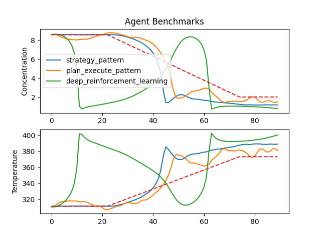

# Composabl SDK — Agent Design Pattern Showcase

A collection of industrial agents built with the **Composabl SDK** — a Python framework for composing intelligent agents from any combination of deep reinforcement learning, model predictive control, classical algorithms, and machine learning models.

The use case is an industrial CSTR (Continuous Stirred Tank Reactor) — an exothermic A→B chemical reaction with a single actuator (jacket coolant temperature), two sensors (reactor temperature, product concentration), and a thermal runaway risk above 400 K. Six progressively sophisticated agent designs solve the same control problem. Each design adds a new SDK capability and the benchmark numbers tell the story.

---

## What the SDK orchestrates

| Technology | Role |
|---|---|
| **Deep Reinforcement Learning** (Ray / RLlib) | Learned skills — each trained on a specific scenario |
| **Model Predictive Control** (do_mpc / CasADi) | Programmed skills — hard-constraint satisfaction |
| **scikit-learn** | Perceptors — enriching observations with ML predictions |
| **Gymnasium** | Simulation interface |
| **gRPC** | Live sim-to-agent communication |
| **Docker** | Portable simulator environments |

---

## Core SDK abstractions

```python
from composabl import Agent, Skill, SkillSelector, SkillGroup, Trainer
from composabl import Teacher, SkillController, Perceptor, PerceptorImpl, Sensor, Scenario
```

| Abstraction | What it is |
|---|---|
| `Agent` | Top-level container. Holds skills, perceptors, and sensors. |
| `Skill` | A single learnable or programmable behavior unit. Backed by a `Teacher` (DRL) or `SkillController` (algorithm). |
| `SkillSelector` | Routes between multiple skills — either learned (DRL) or hard-coded. |
| `SkillGroup` | Chains two skills: one plans, one executes. |
| `Teacher` | Defines reward, termination, success, and action masking for a DRL skill. |
| `SkillController` | Implements a deterministic algorithm (MPC, heuristic, etc.) as a skill. |
| `Perceptor` / `PerceptorImpl` | Transforms raw observations before they reach skills — runs any Python callable. |
| `Sensor` | Named, described observation channel. |
| `Scenario` | A training configuration variant passed to the simulator. |

---

## The six design patterns

All six agents solve the same CSTR control problem. Each pattern builds on the last.

| # | Pattern | Tech | Conversion |
|---|---|---|---|
| 1 | [Single-skill DRL](./chemical_process_control/agents/deep_reinforcement_learning/) | Ray / RLlib | **90%** |
| 2 | [Single-skill MPC (baseline)](./chemical_process_control/agents/model_predictive_control_benchmark/) | do_mpc + CasADi | **82%** |
| 3 | [Strategy — learned selector](./chemical_process_control/agents/strategy_pattern/) | DRL × 4 | **93%** |
| 4 | [Strategy — programmed selector](./chemical_process_control/agents/strategy_pattern_programmed_selector/) | DRL × 3 + Python logic | **93%** |
| 5 | [Strategy + ML perceptor](./chemical_process_control/agents/strategy_pattern_with_perceptor/) | DRL × 4 + sklearn | **~93% + safety** |
| 6 | [Plan-Execute](./chemical_process_control/agents/plan_execute_pattern/) | DRL + MPC | **95%** |



---

## Quick start

```bash
pip install composabl

# Start the simulator
docker pull composabl/sim-cstr
docker run --rm -it -p 1337:1337 composabl/sim-cstr
```

No training needed for the MPC baseline — run inference immediately:

```bash
cd chemical_process_control/agents/model_predictive_control_benchmark
python agent_inference.py
```

To train and run the best-performing agent:

```bash
cd chemical_process_control/agents/plan_execute_pattern
python agent.py          # trains the DRL planning skill
python agent_inference.py
```

All other agents also ship with pre-trained checkpoints so you can run inference on any of them without training.

---

## Repository layout

```
chemical_process_control/
├── sim/                                      # Dockerized gRPC CSTR simulator (scipy ODEs)
└── agents/
    ├── sensors.py                            # shared Sensor definitions
    ├── scenarios.py                          # shared Scenario configurations
    ├── config.py                             # license + target + trainer config
    ├── deep_reinforcement_learning/          # Pattern 1
    ├── model_predictive_control_benchmark/   # Pattern 2
    ├── strategy_pattern/                     # Pattern 3
    ├── strategy_pattern_programmed_selector/ # Pattern 4
    ├── strategy_pattern_with_perceptor/      # Pattern 5
    └── plan_execute_pattern/                 # Pattern 6
```
